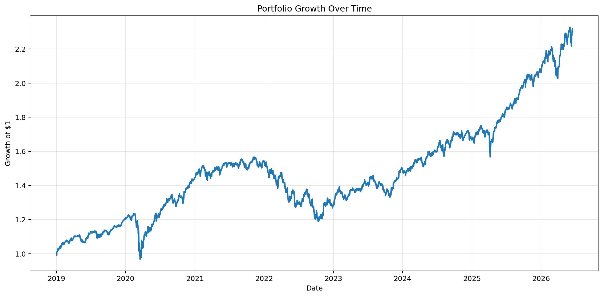
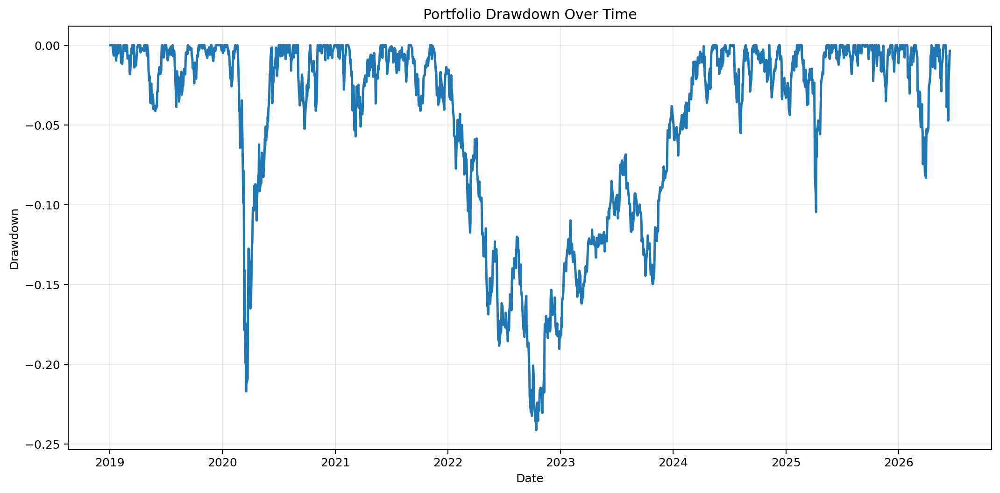
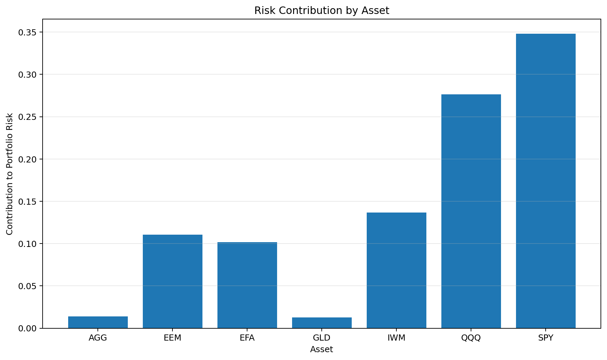
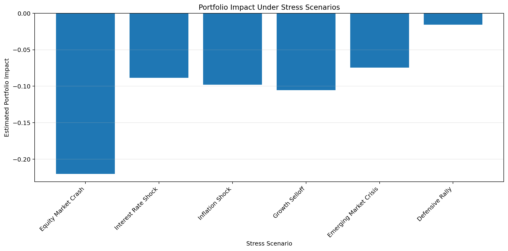
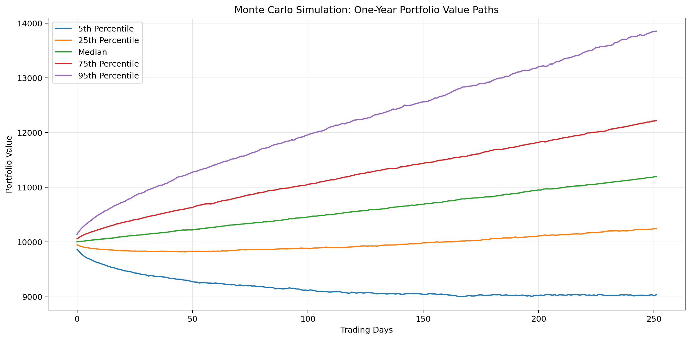
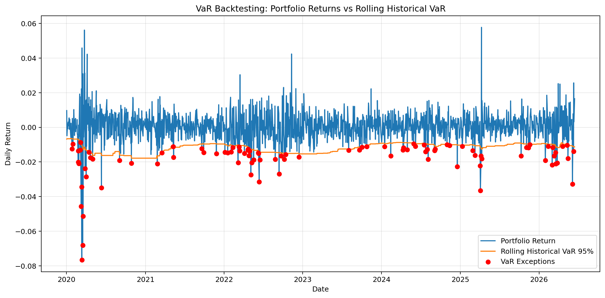

# Market Risk Analytics in Python


Python-based market risk analytics workflow for a diversified ETF portfolio. The project measures historical performance, downside risk, diversification quality, stress scenario exposure, Value at Risk, Conditional Value at Risk, rolling regime behavior, VaR model calibration, and Monte Carlo downside outcomes.

This repository is designed as a practical risk-management notebook rather than a simple return chart. It asks the core portfolio risk question:

> How much can this portfolio lose, where does that risk come from, and how reliable are the assumptions behind the model?

This project is for educational and analytical purposes only. It is not investment advice.

## Project Highlights

- Built a complete Python-based market risk analytics workflow
- Analyzed a multi-asset ETF portfolio using historical market data
- Calculated annualized return, volatility, Sharpe ratio, maximum drawdown, VaR, and CVaR
- Measured diversification using correlation, covariance, and asset-level risk contribution
- Designed stress tests for adverse market scenarios
- Compared historical, parametric, Monte Carlo, and bootstrap risk methods
- Backtested rolling historical VaR with exception analysis and the Kupiec test
- Added correlated asset-level Monte Carlo simulation using the covariance matrix and Cholesky decomposition
- Refactored reusable analytics logic into Python modules under `src/`
- Added automated tests with `pytest`
- Added GitHub Actions continuous integration

## Example Results Snapshot

The notebook updates as new market data becomes available. In one executed run, the portfolio showed the following risk profile:

| Metric | Result |
| --- | ---: |
| Largest risk contributor | SPY |
| SPY risk contribution | 34.82% |
| Highest average correlation | EFA, 0.62 |
| Lowest average correlation | GLD, 0.20 |
| Maximum historical drawdown | -24.14% |
| 95% daily historical VaR loss | 1.21% |
| 95% daily historical CVaR loss | 1.92% |
| Worst stress scenario | Equity Market Crash |
| Worst stress scenario impact | -16.95% |
| One-year Monte Carlo VaR loss | 9.68% |
| One-year Monte Carlo CVaR loss | 14.43% |

The main conclusion is that the portfolio is diversified by asset category, but its risk is still primarily driven by equity exposure.

## Visual Outputs

The notebook generates the following visual outputs. Export the charts into `output/charts/` so they render directly in the GitHub README.

### Portfolio Growth



### Portfolio Drawdown



### Risk Contribution by Asset



### Stress Scenario Impact



### Monte Carlo Simulation



### VaR Backtesting



## Portfolio

The portfolio is a simplified multi-asset ETF allocation intended to represent broad equity, fixed income, and alternative defensive exposure.

| Ticker | Weight | Exposure |
| --- | ---: | --- |
| SPY | 30% | U.S. large-cap equities |
| QQQ | 20% | U.S. growth and technology equities |
| IWM | 10% | U.S. small-cap equities |
| EFA | 10% | Developed international equities |
| EEM | 10% | Emerging-market equities |
| AGG | 15% | U.S. investment-grade bonds |
| GLD | 5% | Gold / alternative defensive exposure |

The allocation is intentionally equity-heavy. That makes it useful for studying how diversification can look reasonable by asset count while still being dominated by common equity market risk.

## Analysis Pipeline

The main notebook, [01_portfolio_risk_modeling.ipynb](notebooks/01_portfolio_risk_modeling.ipynb), implements the following workflow:

1. Define a multi-asset ETF portfolio and validate that weights sum to 100%.
2. Download adjusted historical market prices using `yfinance`.
3. Convert prices into daily simple returns.
4. Build weighted portfolio returns from asset-level returns.
5. Estimate historical risk metrics: return, volatility, Sharpe ratio, drawdown, VaR, and CVaR.
6. Analyze correlation, diversification, covariance, and risk contribution.
7. Run hypothetical market stress scenarios.
8. Simulate one-year portfolio outcomes with Monte Carlo methods.
9. Generate professional risk interpretation and limitations.
10. Extend the model with rolling risk analytics.
11. Compare historical, parametric, Monte Carlo, and bootstrap VaR methods.
12. Backtest rolling historical VaR using exception analysis and the Kupiec test.
13. Improve Monte Carlo modeling with correlated asset-level simulation.
14. Run historical bootstrap simulation to avoid the normal-distribution assumption.
15. Refactor reusable analytics logic into `src/` modules.
16. Validate reusable functions with automated tests.
17. Run tests automatically with GitHub Actions.

## Core Financial Concepts

### Portfolio Returns

Asset returns are calculated as daily percentage changes:

```text
r_t = P_t / P_{t-1} - 1
```

The portfolio return is the weighted sum of asset returns:

```text
R_p,t = w_1 R_1,t + w_2 R_2,t + ... + w_n R_n,t
```

This assumes fixed portfolio weights and no rebalancing frictions, taxes, transaction costs, or cash flows.

### Annualized Return

The notebook annualizes mean daily return using a 252-trading-day convention:

```text
Annualized Return = (1 + mean daily return)^252 - 1
```

This converts daily average performance into an annualized growth estimate.

### Annualized Volatility

Volatility measures the dispersion of daily portfolio returns. It is annualized as:

```text
Annualized Volatility = daily standard deviation * sqrt(252)
```

Volatility is not the same as downside loss, but it is a core measure of uncertainty and is used in Sharpe ratio, parametric VaR, and Monte Carlo modeling.

### Sharpe Ratio

The Sharpe ratio compares return to risk:

```text
Sharpe Ratio = (Annualized Return - Risk-Free Rate) / Annualized Volatility
```

The notebook uses a baseline 0% risk-free rate for simplicity. In production, this should be replaced with a risk-free proxy such as Treasury bill yield data.

### Maximum Drawdown

Maximum drawdown measures the worst peak-to-trough decline:

```text
Drawdown_t = Portfolio Value_t / Running Peak_t - 1
```

This is one of the most intuitive risk metrics because it describes the investor experience of losing capital from a prior high.

## Downside Risk

### Historical VaR

Value at Risk estimates a loss threshold at a chosen confidence level. For 95% historical daily VaR, the notebook identifies the 5th percentile of historical daily portfolio returns:

```text
VaR_95 = 5th percentile of historical daily returns
```

Interpretation: on the worst 5% of historical trading days, losses exceeded this threshold.

### Historical CVaR

Conditional Value at Risk, also called Expected Shortfall, measures the average loss beyond VaR:

```text
CVaR_95 = average return when return <= VaR_95
```

CVaR is usually more informative than VaR because it focuses on tail severity, not only the cutoff point.

## Diversification Analysis

The notebook evaluates whether the portfolio is truly diversified by measuring:

- Pairwise asset correlations
- Average correlation of each asset with the rest of the portfolio
- Covariance-based portfolio volatility
- Marginal and percentage contribution to total portfolio risk

Correlation is critical because a portfolio can hold many assets and still be weakly diversified if those assets sell off together.

### Risk Contribution

Portfolio variance is computed from the covariance matrix:

```text
Portfolio Variance = w' Σ w
Portfolio Volatility = sqrt(w' Σ w)
```

Marginal risk contribution estimates how much each asset contributes to total portfolio volatility:

```text
MRC = Σw / Portfolio Volatility
```

Total asset risk contribution is:

```text
Risk Contribution_i = Weight_i * MRC_i
```

This is important because a position's portfolio weight is not the same as its portfolio risk. A smaller allocation can still contribute heavily to risk if it is volatile or highly correlated with other assets.

## Stress Testing

The project applies manually defined market shock scenarios to estimate portfolio impact under adverse conditions. Each scenario applies percentage shocks to the ETF holdings, then calculates the weighted portfolio loss:

```text
Scenario Portfolio Impact = scenario shocks · portfolio weights
```

Stress testing answers a different question from historical metrics:

> What happens if a specific bad market environment occurs?

The notebook includes scenarios such as equity market crashes, inflation shocks, growth selloffs, bond stress, emerging-market stress, and defensive environments.

Stress testing is not a prediction. It is a risk control tool for identifying vulnerability to specific macro and market regimes.

## Monte Carlo Simulation

The project includes three simulation approaches.

### Portfolio-Level Normal Monte Carlo

The first simulation models the total portfolio return directly using historical portfolio mean and volatility:

```text
Simulated Daily Return ~ Normal(mean portfolio return, portfolio volatility)
```

The simulation generates 10,000 one-year paths over a 252-trading-day horizon and starts from an initial portfolio value of $10,000.

From those simulated paths, the notebook estimates:

- Mean ending value
- Median ending value
- 5th and 95th percentile ending values
- Worst and best simulated ending values
- One-year Monte Carlo VaR
- One-year Monte Carlo CVaR

This model is useful as a baseline, but it assumes normally distributed portfolio returns and therefore may underestimate extreme downside risk.

### Correlated Asset-Level Monte Carlo

The advanced simulation models each asset separately. It uses:

- Historical asset mean return vector
- Historical asset covariance matrix
- Cholesky decomposition to generate correlated random shocks
- Portfolio weights to combine simulated asset returns into portfolio returns

The structure is:

```text
Correlated Asset Returns = Random Normal Shocks × Cholesky(Σ)' + Mean Return Vector
Portfolio Return Path = correlated asset returns · weights
```

This is more realistic than simulating the portfolio as a single normal process because it preserves the historical covariance structure between assets.

However, it still assumes normal asset returns and static covariance. It does not capture fat tails, volatility clustering, liquidity shocks, regime shifts, or correlation breakdowns during crises.

### Historical Bootstrap Simulation

The bootstrap simulation resamples actual historical portfolio returns with replacement:

```text
Bootstrap Daily Return = random sample from historical portfolio returns
```

This avoids the normal-distribution assumption and helps preserve features such as observed skewness, fat tails, and historical downside moves.

The limitation is that bootstrap simulation can only generate outcomes based on events present in the historical sample. It cannot create a new crisis that is structurally different from the past.

## Rolling Risk Analytics

Static full-period metrics can hide risk regime changes, so the notebook also calculates rolling analytics using a 63-trading-day window, approximately one quarter.

Rolling metrics include:

- Rolling annualized volatility
- Rolling Sharpe ratio
- Rolling maximum drawdown
- Rolling correlation between the portfolio and SPY

These diagnostics show how portfolio risk changes across market environments. A portfolio can look diversified over a long sample but become highly correlated with equities during stress periods, exactly when diversification is most valuable.

## VaR Method Comparison

The notebook compares multiple VaR/CVaR methods at 95% and 99% confidence levels.

| Method | Description | Strength | Weakness |
| --- | --- | --- | --- |
| Historical VaR | Uses actual observed portfolio returns | Captures realized historical distribution | Limited to past sample |
| Parametric VaR | Uses mean, volatility, and normal distribution assumption | Simple and fast | Can underestimate fat tails |
| Monte Carlo Normal VaR | Simulates returns using normal assumptions | Flexible simulation framework | Still normality-dependent |
| Bootstrap VaR | Resamples actual historical returns | Avoids normality assumption | Cannot simulate unseen regimes |

Comparing methods is useful because large differences between historical and normal-based VaR estimates may indicate skewness, fat tails, or market stress behavior that normal models do not capture well.

## VaR Backtesting

The notebook backtests the rolling historical VaR model. It calculates a 252-day rolling historical VaR and compares each subsequent daily return against that threshold.

A VaR exception occurs when:

```text
Actual Portfolio Return < Rolling Historical VaR
```

For a 95% VaR model, exceptions should occur approximately 5% of the time.

The notebook also applies the Kupiec Proportion of Failures test, which evaluates whether the observed exception frequency is statistically consistent with the expected exception rate.

This is an important model validation step. A VaR model is not useful only because it produces a number; it should also be tested against realized outcomes.

## Example Findings

The notebook's results update as new market data becomes available. In the current analysis workflow, the portfolio shows several important risk characteristics:

- Equity exposure is the dominant source of portfolio volatility.
- Broad U.S. equity exposure contributes heavily to total risk because of both weight and covariance with other equity assets.
- Gold has lower average correlation with the rest of the portfolio and provides the strongest diversification benefit among the selected ETFs.
- Developed international and other equity assets remain meaningfully correlated with the broader portfolio, limiting diversification.
- Maximum drawdown shows that the portfolio can experience significant peak-to-trough losses despite holding bonds and gold.
- Historical VaR and CVaR quantify daily downside risk using observed return behavior.
- Stress tests show the portfolio is most vulnerable to broad equity market selloffs.
- Monte Carlo simulations show meaningful one-year downside potential under historical mean and volatility assumptions.
- The asset-level Monte Carlo model gives a richer view of risk because it models covariance between assets instead of treating the portfolio as one aggregate process.
- Bootstrap simulation gives a useful alternative view because it avoids assuming normally distributed returns.

## Key Limitations

This project intentionally keeps the model transparent and educational. Important limitations include:

- Historical returns may not represent future returns.
- Correlations and covariances can change quickly during market stress.
- The baseline Monte Carlo model assumes normally distributed returns.
- The asset-level Monte Carlo model still assumes normal asset returns and static covariance.
- Stress scenarios are manually specified and hypothetical.
- Portfolio weights are assumed, not optimized.
- The analysis does not include transaction costs, taxes, slippage, bid-ask spreads, liquidity constraints, or management fees.
- The notebook does not model rebalancing rules or cash flows.
- VaR does not describe the full shape of losses beyond the threshold; CVaR helps but is still model-dependent.
- Backtesting focuses on exception frequency and does not fully test exception clustering or conditional coverage.

## Project Structure

```text
market-risk-analytics-python/
├── .github/
│   └── workflows/
│       └── tests.yml
├── notebooks/
│   ├── 01_portfolio_risk_modeling.ipynb
│   └── executed_01_portfolio_risk_modeling.ipynb
├── outputs/
│   └── charts/
├── reports/
│   ├── decision_log.md
│   └── executive_summary.md
├── src/
│   ├── __init__.py
│   ├── data_loader.py
│   ├── risk_metrics.py
│   ├── simulations.py
│   └── stress_tests.py
├── tests/
│   ├── test_risk_metrics.py
│   ├── test_simulations.py
│   └── test_stress_tests.py
├── README.md
├── requirements.txt
└── .gitignore
```

## How to Run

Clone the repository:

```bash
git clone https://github.com/YOUR_USERNAME/market-risk-analytics-python.git
cd market-risk-analytics-python
```

Create and activate a virtual environment:

```bash
python3 -m venv .venv
source .venv/bin/activate
```

Install dependencies:

```bash
python -m pip install --upgrade pip
python -m pip install -r requirements.txt
```

Launch JupyterLab:

```bash
python -m jupyter lab
```

Then open:

```text
notebooks/01_portfolio_risk_modeling.ipynb
```

To execute the notebook from the terminal and save a results notebook:

```bash
MPLCONFIGDIR=.matplotlib-cache python -m jupyter nbconvert \
  --to notebook \
  --execute notebooks/01_portfolio_risk_modeling.ipynb \
  --output executed_01_portfolio_risk_modeling.ipynb
```

The executed notebook will be saved as:

```text
notebooks/executed_01_portfolio_risk_modeling.ipynb
```

## Testing

Run the test suite from the project root:

```bash
python -m pytest
```

GitHub Actions automatically runs the test suite on pushes and pull requests to `main`.

## Reports

The project includes supporting documentation:

- [Decision Log](reports/decision_log.md): documents major modeling and implementation decisions.
- [Executive Summary](reports/executive_summary.md): summarizes the main risk findings and limitations.

## Technical Stack

- Python
- pandas
- numpy
- matplotlib
- scipy
- yfinance
- Jupyter Notebook / JupyterLab
- pytest
- GitHub Actions

## Possible Extensions

Future improvements could include:

- Optimized portfolios using mean-variance optimization
- Risk parity allocation
- Expected shortfall optimization
- Student-t or skewed fat-tail return distributions
- GARCH volatility modeling
- Regime-switching covariance models
- Component VaR and incremental VaR
- Factor-based risk decomposition
- Liquidity-adjusted VaR
- Conditional coverage VaR backtesting
- Streamlit dashboard
- Automated PDF or HTML report generation

## Summary

This project builds a full market risk analytics workflow around a realistic ETF portfolio. It goes beyond simple performance analysis by combining historical risk, tail risk, drawdown analysis, correlation structure, stress testing, simulation, rolling diagnostics, and model validation.

The central conclusion is that diversification should be measured through risk behavior, not just the number of assets in a portfolio. A portfolio can hold multiple ETFs across regions and asset classes while still being primarily exposed to equity market drawdowns. Robust risk analysis requires looking at volatility, covariance, tail loss, stress scenarios, and how those relationships change over time.
